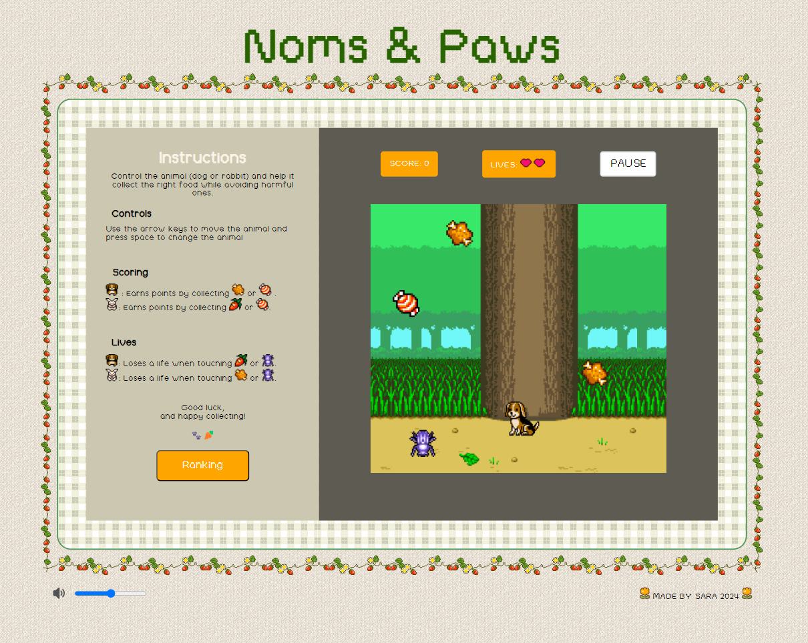

# Noms & Paws

 

## Description

**Noms & Paws** is an interactive game where players control an animal (either a dog or a rabbit) and must collect different types of food while avoiding other objects. The goal is to score points by collecting the correct food items if the player touches the wrong objects the animal loses a life.

**Check out the project here!** https://saragarpa.github.io/noms-paws/

## Game Objectives

- **Food Collection:**

  - The dog scores points by touching **meat** or **candy**.
  - The rabbit scores points by touching **carrot** or **candy**.

- **Life Loss:**

  - The dog loses a life when touching **carrot** or **bug**.
  - The rabbit loses a life when touching **meat** or **bug**.

- The game ends when the player runs out of lives, displaying a "Game Over" screen.

## Technologies Used

- **HTML**: Structure of the game.
- **CSS**: Styles and visual design.
- **JavaScript**: Game logic and event management.

## Instructions to Play

1. Click the start button to begin the game.
2. Use the arrow keys to move the animal.
3. Press space to change animal.
4. Try to collect the correct food and avoid the objects that cost lives.

## Difficulty

As the player progresses, the game's difficulty increases. For every 100 points scored, the speed at which food falls increases, making it harder for the player to keep up and requiring quicker coordination to avoid incorrect items.

## File Structure

- `index.html`: Contains the HTML structure of the game.
- `styles.css`: Defines the styles and design of the game.
- `game.js`: Contains the main game logic, collision detection, and scoring.
- `main.js`: Handles the game start events and updates the DOM.

## VERSION 1.0 (addittions, issues,... )

- Add animations per correct/incorrect food.
- When returning from a screen, animal should always be dog.
- Improve responsiveness.

 